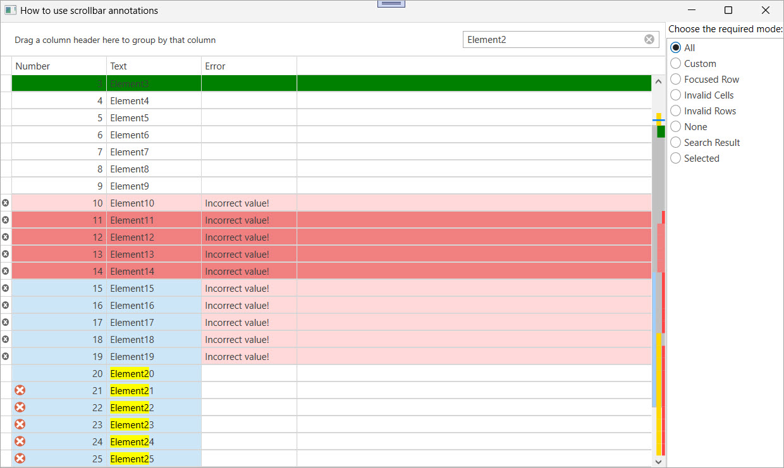

<!-- default badges list -->

[](https://supportcenter.devexpress.com/ticket/details/T534664)
[](https://docs.devexpress.com/GeneralInformation/403183)
[](#does-this-example-address-your-development-requirementsobjectives)
<!-- default badges end -->

# WPF Grid – Display Scrollbar Annotations

This example introduces [Scrollbar Annotations](https://docs.devexpress.com/WPF/18068/controls-and-libraries/data-grid/paging-and-scrolling/scrollbar-annotations) in the WPF [`GridControl`](https://docs.devexpress.com/WPF/DevExpress.Xpf.Grid.GridControl). When the grid loads, its vertical scrollbar displays annotations that indicate the location of search results and selected cells. These visual markers allow users to quickly navigate to relevant data.



## Implementation Details

The example displays a side panel that lists annotation modes supported by the `GridControl`. When a user selects a mode, the bound [ScrollBarAnnotationMode](https://docs.devexpress.com/WPF/DevExpress.Xpf.Grid.TableView.ScrollBarAnnotationMode) property updates accordingly:

```xaml
<dxg:TableView x:Name="myView"  
               ScrollBarAnnotationMode="{Binding EditValue, ElementName=myListBoxEdit, UpdateSourceTrigger=PropertyChanged, Mode=TwoWay}"
               ScrollBarCustomRowAnnotation="MyScrollBarCustomRowAnnotationEventHandler" />
```

The `GridControl` can display annotations for the following items:

* Focused and selected rows
* Invalid rows and cells
* Search results

To define additional annotations based on custom rules, handle the [`ScrollBarCustomRowAnnotation`](https://docs.devexpress.com/WPF/DevExpress.Xpf.Grid.TableView.ScrollBarCustomRowAnnotation) event. In this example, the event handler checks the `Number` property of a row’s data object and displays a custom annotation if the value falls within certain ranges:
 
```csharp
void MyScrollBarCustomRowAnnotationEventHandler(object sender, ScrollBarCustomRowAnnotationEventArgs e) {
    if (e.Row is not TestData data) return;
    int number = data.Number;
    if (number > 10 && number < 15)
        ShowCustomScrollAnnotation(e, Brushes.LightCoral);
    if (number > 2 && number < 4)
        ShowCustomScrollAnnotation(e, Brushes.Green);
}

void ShowCustomScrollAnnotation(ScrollBarCustomRowAnnotationEventArgs e, SolidColorBrush brush) {
    e.ScrollBarAnnotationInfo = new ScrollBarAnnotationInfo() {
        Alignment = ScrollBarAnnotationAlignment.Right,
        Brush = brush,
        MinHeight = 3,
        Width = 10
    };
}
```

## Files to Review

* [MainWindow.xaml](./CS/WpfApplication25/MainWindow.xaml) (VB: [MainWindow.xaml](./VB/WpfApplication25/MainWindow.xaml))
* [MainWindow.xaml.cs](./CS/WpfApplication25/MainWindow.xaml.cs) (VB: [MainWindow.xaml.vb](./VB/WpfApplication25/MainWindow.xaml.vb))
* [ViewModel.cs](./CS/WpfApplication25/ViewModel.cs) (VB: [ViewModel.vb](./VB/WpfApplication25/ViewModel.vb))

## Documentation

* [GridControl](https://docs.devexpress.com/WPF/DevExpress.Xpf.Grid.GridControl)
* [TableView](https://docs.devexpress.com/WPF/DevExpress.Xpf.Grid.TableView)
* [ListBoxEdit](https://docs.devexpress.com/WPF/DevExpress.Xpf.Editors.ListBoxEdit)
* [ScrollBarAnnotationInfo](https://docs.devexpress.com/WPF/DevExpress.Xpf.Grid.ScrollBarAnnotationInfo)
* [Scrollbar Annotations](https://documentation.devexpress.com/WPF/18068/Controls-and-Libraries/Data-Grid/Data-Scrolling/Scrollbar-Annotations)

## More Examples

* [WPF Data Grid – Specify Custom Content for Column Chooser Headers](https://github.com/DevExpress-Examples/wpf-data-grid-custom-content-for-column-chooser-headers)
* [WPF Data Grid – Handle Drag and Drop Operations](https://github.com/DevExpress-Examples/wpf-grid-handle-drag-and-drop)
* [WPF Data Grid – Bind to Dynamic Data](https://github.com/DevExpress-Examples/wpf-bind-gridcontrol-to-dynamic-data)

## Does this example address your development requirements/objectives?

[](https://www.devexpress.com/support/examples/survey.xml?utm_source=github&utm_campaign=wpf-grid-scrollbar-annotations&~~~was_helpful=yes) [](https://www.devexpress.com/support/examples/survey.xml?utm_source=github&utm_campaign=wpf-grid-scrollbar-annotations&~~~was_helpful=no)

(you will be redirected to DevExpress.com to submit your response)
<!-- feedback end -->
<!-- feedback -->
## Does this example address your development requirements/objectives?

[](https://www.devexpress.com/support/examples/survey.xml?utm_source=github&utm_campaign=wpf-grid-scrollbar-annotations&~~~was_helpful=yes) [](https://www.devexpress.com/support/examples/survey.xml?utm_source=github&utm_campaign=wpf-grid-scrollbar-annotations&~~~was_helpful=no)

(you will be redirected to DevExpress.com to submit your response)
<!-- feedback end -->
